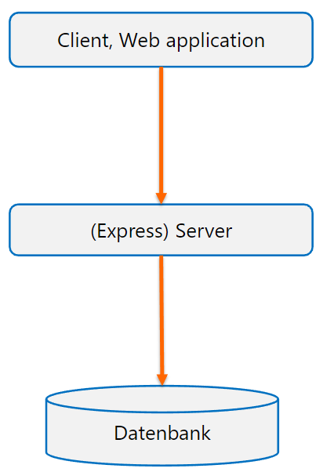
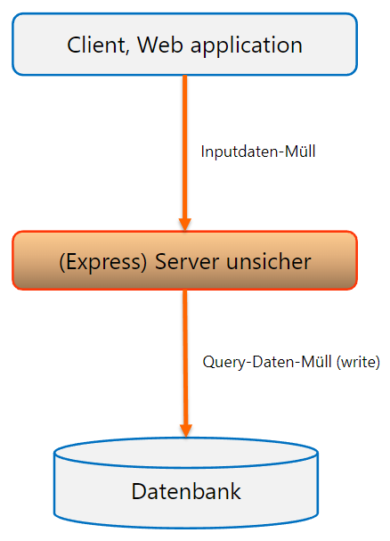
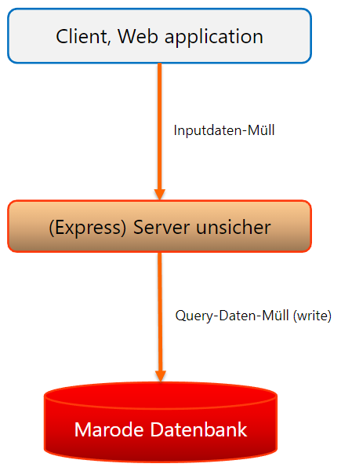
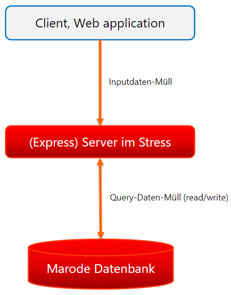
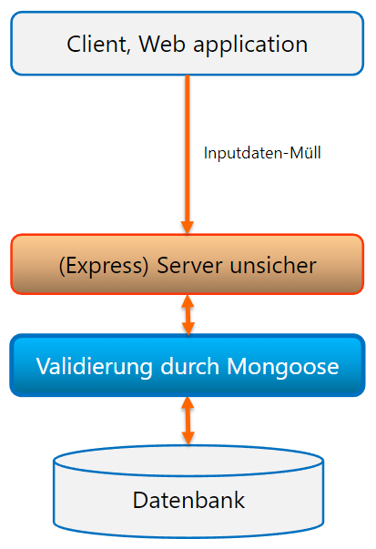
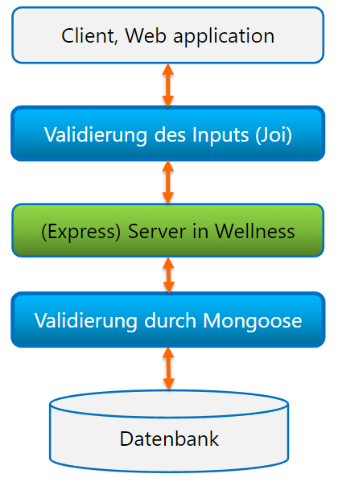

<!-- _paginate: false -->
# Web-Development Backend

JOI und JWT - Server vor invalidem Input schützen
oder:
Wie mache ich den Server kaputt?
<br>
[webdev.andreasnicklaus.de](https://webdev.andreasnicklaus.de)

# Was haben wir bisher gemacht?:white_check_mark: HTTP-Server mit Express
:white_check_mark: HTML-Rendering mit EJS
:white_check_mark: Datenbankanbindung mit MongoDB
:white_check_mark: Datenbankverwaltung mit Mongoose
:white_check_mark: 2-Way-Kommunikation mit Websockets
:white_square_button: ???
:white_square_button: ???

# Ungeschützte Architektur

# Ungeschützte Architektur

# Ungeschützte Architektur

# Ungeschützte Architektur

# Geschützte Datenbankstruktur


# Beispiel Twitter

Welche Arten von schlechten Inputs können wir erfahren?

```json
{
  "authorId" : "ElonMusksUserId",
  "content" : "Mark Zuckerberg is a great business man.",
  "creationTime": 1705326917363
}
```

# Beispiel Twitter
Schlechte Inputs

```json
{
  "authorId" : "iReallyAmElonMusk",
  "content" : "Mark Zuckerberg $§%&/&",
  "creationTime": 000000001
}
```
```json
{
  "content" : 123456,
  "creationTime": "1603-01-01T00:00:00.000Z",
}
```

# SQL Injection
```json
{
  "authorId" : "ElonMusksUserId'; DELETE * from Users; COMMIT;",
  "content" : "123456",
  "creationTime": 1705326917363
}
```
```sql
SELECT * from Users where id='ElonMusksUserId'; DELETE * from Users; COMMIT;'
```

# Schlechte Inputs

- Felder nicht gefüllt
- Felder nicht vorhanden
- Felder haben nicht den richtigen Typ
- Inhalt ist logisch nicht richtig
- Inhalt ist nicht erlaubt

# Inputvalidierung mit JOI

```js
const Joi = require('joi')

const myTwitterPostSchema = Joi.object({
  authorId: Joi.string().alphanum().required(),
  content: Joi.string().min(1).required(),
  creationTime: Joi.number().integer()
    .min(new Date().valueOf()-60000)
    .max(new Date().valueOf()).required()
})

const data = {
  authorId: "097151d159a0467ea3b45ec37abf771c",
  content: "Twitter was lame. I love X! <3"
}

const result = myTwitterPostSchema.validate(data)
if (result.error) console.error(result.error.message)
```

# Weitere Validierungsmöglichkeiten


```js
// Joi.object() beschreibt ein JS-Object
const schema = Joi.object({
  // Joi.string() beschreibt ein JS-String
    username: Joi.string().alphanum().min(3).max(30).required(),

    // .pattern() erlaubt eine Regular Expression
    password: Joi.string().pattern(new RegExp('^[a-zA-Z0-9]{3,30}$')),

    // .ref() verweist auf ein anderes Schema
    repeat_password: Joi.ref('password'),

    // Array erlaubt mehrere optionale Typen 
    access_token: [Joi.string(), Joi.number()],

    // string.email() defniert den String als E-Mail-Adresse
    email: Joi.string().email({ minDomainSegments: 2, tlds: { allow: ['com', 'net'] } })
})
```
<!-- _footer: "[https://github.com/hapijs/joi/blob/v14.3.1/API.md](https://github.com/hapijs/joi/blob/v17.11.0/API.md)"
 -->

# Beispiel für Einbindung an Express-Server
```js
app.post('/post', (req, res, next) => {
  const myTwitterPostSchema = Joi.object({
  authorId: Joi.string().alphanum().required(),
  content: Joi.string().min(1).required(),
  creationTime: Joi.number().integer()
    .min(new Date().valueOf()-60000).max(new Date().valueOf()).required()
})
  const result = myTwitterPostSchema.validate(req.body) 
  
  if (!result.error) { 
    res.status(422).json({ 
      message: 'Invalid request, error: ' + error.message, 
      data: req.body
    }) 
  } else { 
    createPost(data).then((createdPost) => {
      res.json({ message: 'Post created', data: createdPost }) 
    })
  } 
})
```

# Beispiel für Einbindung als Express-Middleware
```js
validateSchema = function (schema = null, property = null) {
  function middleware(req, res, next) {
    if (!JOI_ENABLED) return next()
    else {
      const { value, error } = schema.validate(req[property])

      if (error) {
        next(error);
        return;
      }
      else next()
    }
  }

  return middleware
}

app.post('/post', validateSchema(myTwitterPostSchema, "body"), => {
  ...
})
```

# Geschützter Backend-Server


## Was denkt ihr?

1. Ist das einfach?
2. Ist das effektiv?
3. Welche Problemen ergeben sich?

# Authentisierung falsch gemacht

```json
{
  "myId": "097151d159a0467ea3b45ec37abf771c",
  "post": {
    "content": "This is a funny tweet about spaghetti.",
    "creationTime": 1705326917363
  }
}
```
Ist das sicher?

# Authentisierung richtig gemacht

> The HTTP Authorization request header can be used to provide credentials that authenticate a user agent with a server, allowing access to a protected resource.

`Authorization: <auth-scheme> <authorization-parameters>`

Hier werden 2 Authentisierungsschemas vorgestellt, es gibt aber noch mehr:
1. Basic
2. Bearer

<!-- _footer: "[https://developer.mozilla.org/en-US/docs/Web/HTTP/Headers/Authorization](https://developer.mozilla.org/en-US/docs/Web/HTTP/Headers/Authorization)" -->

## Basic Authentisierung

`Authorization: Basic <base64('<username>:<password>')>`

- Authentisierungsschema: `Basic`
- Authentisierungsparameter besteht aus dem Base64-enkodiertem String `<username>:<password>`

<div style="background-color: #ff4400aa; border: solid 6px #ff4400; padding: 10px 20px; margin: 10px 0; border-radius: 10px;">
  <span style="color: white;">Warnung: Base64-encoding kann einfach zum ursprünglichen Namen und Passwort dekodiert werden. Basic Authentisierung ist deshalb <b>vollständig unsicher</b>. HTTPS is immer empfohlen, wenn Authentisierung benutzt wird, aber besonders bei `Basic` Authentisierung.</span>
</div>

<!--
_footer: "[https://developer.mozilla.org/en-US/docs/Web/HTTP/Headers/Authorization#basic](https://developer.mozilla.org/en-US/docs/Web/HTTP/Headers/Authorization#basic)"
-->

## Bearer Authentisierung

`Authorization: Bearer <Token>`

- Authentisierungsschema: `Bearer`
- Authentisierungsparameter besteht aus einem Token, das der Client nie anfassen will und soll

Bearer Authentisierung erfordert, dass der Token vom Client nicht verändert werden kann

:arrow_right: JSON Web Tokens

# Intermezzo: IDs


ID-Formate:
- Youtube: `xxxxx-xxxxx` alphanumerisch
- IG Reels: `xxxxxxxxxxx` alphanumerisch
- Twitter/X: `0000000000000000000` numerisch
- IG Stories: `0000000000000000000` numerisch

# Intermezzo: IDs
Beispiel Youtube: `https://www.youtube.com/watch?v=ElHFJ-8Hy6E`

Ein paar Fragen zur Auswahl des Formats:
- Welche ID wird als nächste vergeben? Sollte ich dieses Video aufrufen können?
- Wie viele Varianten gibt das Format her?
- Wie groß ist die Wahrscheinlichkeit, eine ID zu erraten?

# JSON Web Token (JWT)

- Verschlüsselte Tokens zur Authentifizierung von JSON-Daten

1. Datenintegrität: Signierte Tokens
2. Datenverschlüsselung: Daten werden geheim gehalten

Online Token-Generator: [https://jwt.io/](https://jwt.io/)

# Aufbau eines JWT

`hhhhh.pppppppppppppppppppppp.ssssssssssss`

1. Header
2. Payload
3. Signature

## JWT Teil 1/3: Header

```json
{
  "alg": "HS256",
  "typ": "JWT"
}
```
wird Base64Url kodiert.

## JWT Teil 2/3: Payload

```json
{
  "sub": "1234567890",
  "name": "John Doe",
  "iat": 1516171819
}
```
wird Base64Url kodiert.

- Properties des Payloads werden **Claim** genannt
- Registrierte Claims sind `sub` (Subject), `iss` (Issuer), `exp` (Expiration Time), `aud` (Audience, Array of Strings), `iat` (Issued at), `jti` (JWT Id), `nbf` (Not before)
- Neben Public Claims der JSON Web Token Claims Registry sind auch
**Private Claims** erlaubt **(Vorsicht vor Kollisionen)**

## JWT Teil 3/3: Signature

```js
HMAC(Base64Url(header).Base64Url(payload), secret)
```

- Im einfachen Fall werden Header und Payload mit HMAC-Verschlüsselung (hash-base message auth code) symmetrisch Verschlüsselt.
- Payload und Header werden dennoch unverschlüsselt verwendet.

# Warum sind JWTs sicher?

- Header und Payload sind Base64-enkodiert :arrow_right: **Lesbar und veränderbar**
- Signatur enthält Secret und Payload :arrow_right: **Änderungen sind nachweisbar**

<br>

- Änderungen sind nicht reversibel, das Original bleibt unbekannt.
- Keine sensiblen Daten sollten in JWTs verpackt werden.

# JWT mit RSA-Verschlüsselung

```js
const message =
  RSA_with_publicKey_of_receiver(Base64(Header)) + "." +
  RSA_with_publicKey_of_receiver(Base64(Payload))

const signature = RSA_with_privateKey_of_sender(message)
```

# Verwendung von JWTs im Client

```js
// Token wird vom letzten Request gespeichert, modifiziert und/oder generiert
const token = getOrGenerateToken()

fetch("http://example.com/path/",
  {
    method: 'POST',
    headers: {
      'Content-Type': 'application/json',
      Authorization: 'Bearer ' + token
    },
    body: JSON.stringify({...data})
  }
)
```

# Generierung von JWTs im Server

```js
const jwt = require('jsonwebtoken')

const SECRET = require('crypto').randomBytes(64).toString('hex')
// '09f26e402586e2faa8da4c98a35f1b20d6b033c6097befa8be3486a829587fe2f90a832bd
//  3ff9d42710a4da095a2ce285b009f0c3730cd9b8e1af3eb84df6611'

function generateAccessToken(username) {
  return jwt.sign(username, SECRET, { expiresIn: '1800s' })
}

app.post('/path', (req, res) => {
  const token = generateAccessToken({ username: req.body.username })
  res.json(token);
})
```

# JWT-Dekodierung

```js
app.post('/path', authenticateToken, (req, res) => {
  // handle request
})

//middleware for authentication
function authenticateToken(req, res, next) {
  const authHeader = req.headers['authorization']
  const token = authHeader.split(' ')[1]
  if (token == null) return res.sendStatus(401)
  jwt.verify(token, SECRET, (err, user) => {
    if (err) 
      return res.sendStatus(403)
    req.user = user
    next()
  })
}
```

# Nutzung von JWTs
:arrow_right: [Codebeispiel](https://gitlab.mi.hdm-stuttgart.de/fridtjof/web-development-backend/-/tree/master/examples/06-joi-jwt?ref_type=heads)

# Was haben wir erreicht?

:white_check_mark: HTTP-Server mit Express
:white_check_mark: HTML-Rendering mit EJS
:white_check_mark: Datenbankanbindung mit MongoDB
:white_check_mark: Datenbankverwaltung mit Mongoose
:white_check_mark: 2-Way-Kommunikation mit Websockets
:white_check_mark: Inputvalidierung mit JOI
:white_check_mark: Authentisierung mit JSON Web Tokens